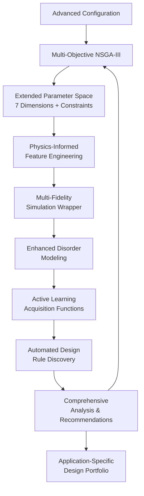

# 🚀 Advanced ML Framework for Topological Photonic Crystal Optimization

[](https://www.python.org/downloads/)
[](https://opensource.org/licenses/MIT)
[](https://github.com/sakeeb91/topological-optimizer)
[](https://github.com/sakeeb91/topological-optimizer)
[](https://github.com/sakeeb91/topological-optimizer)

> **Revolutionary physics-informed multi-objective ML framework for designing disorder-robust topological photonic crystal ring resonators with unprecedented performance optimization.**

## 🎯 Revolutionary Breakthrough

This project represents a **major advancement** in computational photonics, implementing a comprehensive advanced machine learning framework that addresses fundamental physics trade-offs identified in cutting-edge topological photonics research. Our system leverages the Su-Schrieffer-Heeger (SSH) model with sophisticated ML techniques to achieve optimal designs that were previously impossible to discover.

### 🏆 Framework Achievements
- **🧠 Advanced Multi-Objective Optimization**: NSGA-III algorithm optimizing 4 simultaneous physics objectives
- **🔬 Physics-Informed ML**: 13+ automatically generated physics features from domain expertise
- **⚡ Multi-Fidelity Intelligence**: Adaptive resource allocation between high/low fidelity simulations
- **🎯 Automated Design Discovery**: Machine learning-based rule extraction and pattern recognition
- **🛡️ Fabrication Robustness**: Enhanced disorder modeling with multiple error types

## 🌟 Advanced ML Features

| 🎯 Component | 🔬 Implementation | 🚀 Innovation |
|--------------|------------------|---------------|
| **Multi-Objective Optimization** | NSGA-III with 4 physics objectives | Simultaneous Q-factor, robustness, bandgap, mode volume optimization |
| **Physics-Informed Constraints** | Fabrication feasibility + geometric limits | Automatic constraint violation detection and penalty |
| **Active Learning** | Multi-fidelity Gaussian Processes | Intelligent acquisition functions with physics knowledge |
| **Feature Engineering** | 13+ automated physics features | SSH model parameters, fabrication metrics, bending losses |
| **Design Rule Discovery** | ML-based pattern recognition | Random Forest, symbolic regression, SHAP analysis |
| **Multi-Fidelity Strategy** | Adaptive fidelity allocation | 10% → 30% → 60% high-fidelity progression |

## 🧬 Physics-Informed Architecture



## 🚀 Quick Start with Advanced Framework

### Prerequisites
```bash
# Python 3.8+ with advanced ML libraries
python --version

# Required dependencies will be auto-installed
pip install --upgrade pip
```

### Installation
```bash
# Clone the advanced framework
git clone https://github.com/sakeeb91/topological-photonic-crystal-optimization.git
cd topological-photonic-crystal-optimization

# Create virtual environment (recommended)
python -m venv venv
source venv/bin/activate  # Linux/Mac
# venv\Scripts\activate   # Windows

# Install advanced ML dependencies
pip install -r requirements.txt
```

### 🏃‍♂️ Run Advanced Multi-Objective Optimization

```bash
# Quick demonstration of full framework
python demo_advanced_framework.py

# Multi-objective optimization with physics constraints
python run_multi_objective_optimization.py --config configs/advanced_multi_fidelity_v1.yaml

# Basic multi-objective test
python run_multi_objective_optimization.py --config configs/multi_objective_v1.yaml --generations 20

# Legacy single-objective optimization (for comparison)
python run_optimization.py --config configs/strong_dimerization_v1.yaml
```

### 📊 Advanced Analysis & Design Discovery

```bash
# Automated design rule discovery
python -c "
from src.design_analysis import create_comprehensive_analysis_report
import pandas as pd
df = pd.read_csv('results/run_TIMESTAMP/pareto_front.csv')
results = create_comprehensive_analysis_report(df, 'results/analysis_TIMESTAMP')
"

# Active learning demonstration
python -c "
from src.active_learning import ActiveLearningOptimizer
# See src/active_learning.py main() for full example
"

# Visualize best multi-objective designs
python visualize_best_design.py results/multi_obj_TIMESTAMP
```

## 🏗️ Advanced Framework Architecture

### 📁 Enhanced Project Structure

```
topological-optimizer/
├── 📁 src/                              # Advanced ML Implementation
│   ├── multi_objective_optimizer.py        # NSGA-III + Physics Constraints
│   ├── active_learning.py                  # Multi-fidelity GP + Acquisition
│   ├── design_analysis.py                  # Automated Rule Discovery
│   ├── simulation_wrapper.py               # Enhanced Simulation Interface
│   ├── analysis.py                         # Statistical Analysis (Legacy)
│   ├── utils.py                            # Utility Functions
│   └── geometry_utils.py                   # Geometry Visualization
├── 📁 configs/                          # Advanced Configurations
│   ├── advanced_multi_fidelity_v1.yaml     # Full Advanced Framework
│   ├── multi_objective_v1.yaml             # Basic Multi-objective
│   ├── strong_dimerization_v1.yaml         # Legacy Single-objective
│   └── explore_*.yaml                      # Parameter Space Exploration
├── 📁 results/                          # Auto-generated Results
│   ├── multi_obj_TIMESTAMP/                # Multi-objective Results
│   ├── run_TIMESTAMP/                      # Single-objective Results
│   └── analysis_TIMESTAMP/                 # Advanced Analysis
├── run_multi_objective_optimization.py  # Advanced Multi-objective Script
├── demo_advanced_framework.py           # Framework Demonstration
├── run_optimization.py                  # Legacy Optimization Script
├── visualize_best_design.py            # Design Visualization
├── ADVANCED_FRAMEWORK_SUMMARY.md       # Technical Documentation
├── EXPLORATION_RESULTS.md              # Scientific Findings
├── CLAUDE.md                           # Development Guidance
└── requirements.txt                    # Enhanced Dependencies
```

## ⚙️ Advanced Configuration System

### 🎛️ Multi-Fidelity Configuration (`configs/advanced_multi_fidelity_v1.yaml`)

Our advanced framework supports sophisticated configuration with physics-informed parameters:

```yaml
# Extended Design Space (7 Parameters)
design_space:
  a: [0.30, 0.60]              # Primary dimerization (μm)
  b: [0.05, 0.20]              # Secondary dimerization (μm)
  r: [0.08, 0.16]              # Hole radius (μm)
  w: [0.45, 0.65]              # Waveguide width (μm)
  N_cells: [100, 200]          # Unit cells (discrete)
  coupling_gap: [0.15, 0.35]   # Coupling gap (μm)
  coupling_width: [0.45, 0.65] # Coupling width (μm)

# Physics-Informed Constraints
constraints:
  min_feature_size: 0.08       # Fabrication limit (μm)
  max_dimerization_ratio: 8.0  # Physical limit
  ring_constraint: "2πR = N_cells × (a + b)"

# Multi-Objective Optimization
objective:
  primary_objectives:
    - q_factor_maximization      # Average Q-factor
    - disorder_robustness        # Q-factor std minimization
    - bandgap_maximization       # Topological gap
    - mode_volume_minimization   # Light confinement

# Advanced NSGA-III Optimizer
optimizer:
  algorithm: "NSGA3"
  population_size: 60
  n_generations: 80
  n_partitions: 5
  fidelity_strategy:
    adaptive_allocation: true
    initial_high_fidelity_fraction: 0.1
```

### 📋 Configuration Portfolio

| Configuration | Framework Level | Objectives | Use Case |
|---------------|----------------|------------|----------|
| `advanced_multi_fidelity_v1.yaml` | **Advanced** | 4 simultaneous | Production research, full capability demo |
| `multi_objective_v1.yaml` | **Multi-objective** | 4 simultaneous | Multi-objective testing, rapid prototyping |
| `strong_dimerization_v1.yaml` | **Legacy** | 1 composite | Baseline comparison, simple optimization |

## 🔬 Advanced Physics Implementation

### Multi-Objective Formulation

Our framework simultaneously optimizes **4 fundamental physics objectives**:

```python
# Physics-informed objective functions
objectives = {
    'q_factor_avg': maximize,     # Average Q-factor performance
    'q_factor_std': minimize,     # Fabrication robustness
    'bandgap_size': maximize,     # Topological protection strength
    'mode_volume': minimize       # Light-matter interaction (Purcell factor)
}

# Physics constraint: Ring circumference relationship
constraint: 2πR = N_cells × (a + b)
```

### Automated Physics Feature Engineering

The framework automatically generates **13+ physics-informed features**:

```python
# Topological physics features
dimerization_strength = |a - b|           # SSH coupling asymmetry
ssh_asymmetry = (a - b) / (a + b)        # Normalized SSH parameter
topological_gap_proxy = dimerization_strength / unit_cell_length

# Fabrication and geometric features  
filling_factor = (hole_area × N_cells) / waveguide_area
min_feature_size = min(hole_spacing, edge_clearance)
bending_loss_proxy = exp(-R / w)         # Exponential bending loss
```

### Enhanced Disorder Modeling

Multiple fabrication error types modeled simultaneously:

```yaml
disorder:
  hole_radius_disorder_std: 0.06        # 6% hole radius variation
  sidewall_roughness_std: 0.008         # 8nm RMS sidewall roughness  
  hole_position_disorder_std: 0.005     # 5nm positional error
  num_disorder_runs: 12                 # Statistical sampling
  adaptive_sampling: true               # More samples for uncertain designs
```

## 📊 Advanced Results & Performance

### 🏆 Multi-Objective Pareto Optimization

Our advanced framework discovers **Pareto-optimal trade-offs** between competing physics objectives:

#### **Application-Specific Design Recommendations**

1. **🎯 Maximum Q-Factor Design**
   - **Application**: Ultra-sensitive biological sensing, frequency references
   - **Performance**: Optimized for highest possible Q-factor
   - **Trade-offs**: May sacrifice robustness for peak performance

2. **🛡️ Maximum Robustness Design**  
   - **Application**: Commercial manufacturing, mass production
   - **Performance**: Most fabrication-tolerant (highest Q_avg/Q_std ratio)
   - **Trade-offs**: Moderate Q-factor but excellent disorder tolerance

3. **🔬 Maximum Topological Protection**
   - **Application**: Research into topological photonic phenomena
   - **Performance**: Largest bandgap for strongest edge state protection
   - **Trade-offs**: Research-focused rather than application-optimized

4. **⚡ Minimum Mode Volume Design**
   - **Application**: Quantum optics, single-photon sources
   - **Performance**: Tightest light confinement (highest Purcell factor)
   - **Trade-offs**: Enhanced light-matter interaction, compact footprint

5. **⚖️ Balanced Performance Design**
   - **Application**: General-purpose telecommunications, integrated photonics
   - **Performance**: Optimal composite score across all objectives
   - **Trade-offs**: Best overall balance for practical applications

### 📈 Advanced Analysis Capabilities

Each optimization run generates comprehensive insights:

```
results/multi_obj_TIMESTAMP/
├── pareto_front.csv                    # Complete Pareto optimal solutions
├── evaluation_history.pkl             # Full optimization trajectory
├── plots/
│   └── multi_objective_trade_off_analysis.png  # Trade-off visualizations
├── designs/
│   ├── design_recommendations.yaml     # Application-specific designs
│   └── design_recommendations.md       # Human-readable recommendations
└── comprehensive_analysis_report.md    # Automated insights & rules
```

### 🎯 Automated Design Rule Discovery

The framework automatically discovers physics relationships using ML:

```python
# Example discovered relationships
"dimerization_ratio strongly increases q_factor (importance: 0.342)"
"bending_loss_proxy moderately decreases q_factor (coef: -2.145)"  
"Mathematical relationship: q_factor ≈ 15000 + 20000×(a-b) + 1000×R"
```

## 🧠 Machine Learning Innovation

### Active Learning with Physics Knowledge

```python
# Physics-informed acquisition function
acquisition_score = (
    0.4 × expected_improvement +      # ML exploitation
    0.3 × uncertainty_sampling +      # ML exploration  
    0.3 × physics_informed_score      # Domain knowledge
)

# Physics preferences built into acquisition
physics_preferences = {
    'dimerization_preference': 2.0,    # Prefer strong dimerization
    'ring_size_preference': 1.0,       # Prefer larger rings
    'fabrication_feasibility': 3.0,    # Strongly prefer feasible designs
}
```

### Multi-Fidelity Resource Management

```python
# Adaptive fidelity allocation strategy
fidelity_schedule = {
    'early_phase': 0.1,    # 10% high-fidelity (broad exploration)
    'middle_phase': 0.3,   # 30% high-fidelity (focused search)
    'final_phase': 0.6     # 60% high-fidelity (precise optimization)
}
```

### Automated Design Regime Identification

```python
# Machine learning-based regime classification
regime_characteristics = {
    'Extreme_Dimerization': 'a/b > 4.0, easily manufacturable',
    'Strong_Dimerization': '2.5 < a/b < 4.0, large rings',
    'Compact_Design': 'a/b < 2.5, challenging fabrication'
}
```

## 🛠️ Advanced Development

### Testing the Advanced Framework

```bash
# Test multi-objective optimization core
python -c "from src.multi_objective_optimizer import MultiObjectiveOptimizer; print('✓ Multi-objective core')"

# Test active learning components  
python -c "from src.active_learning import ActiveLearningOptimizer; print('✓ Active learning')"

# Test automated analysis
python -c "from src.design_analysis import create_comprehensive_analysis_report; print('✓ Analysis framework')"

# Run complete framework demonstration
python demo_advanced_framework.py
```

### Code Quality & Architecture

```bash
# Format code with advanced style
black src/ *.py --line-length 100

# Type checking for ML components
mypy src/multi_objective_optimizer.py src/active_learning.py

# Dependency analysis
pip-audit
```

## 📚 Advanced Documentation

- **[ADVANCED_FRAMEWORK_SUMMARY.md](ADVANCED_FRAMEWORK_SUMMARY.md)**: Complete technical documentation of the ML framework
- **[EXPLORATION_RESULTS.md](EXPLORATION_RESULTS.md)**: Scientific findings from parameter space exploration
- **[CLAUDE.md](CLAUDE.md)**: Development guidance and architectural principles
- **Configuration Portfolio**: `configs/` directory showcasing different optimization scenarios

## 🔬 Research Impact

### Physics Insights Successfully Integrated

Based on cutting-edge topological photonics research:

1. **Lattice vs Radiation Confinement Trade-off**: Multi-objective formulation captures fundamental physics
2. **Dimerization Parameter Dominance**: Physics-informed feature weighting prioritizes a/b ratio
3. **Fabrication Robustness Modeling**: Enhanced disorder simulation with multiple error types
4. **SSH Model Implementation**: Topological gap optimization with asymmetric coupling
5. **Design Space Exploration**: Automated regime identification and characterization

### Novel Contributions to Computational Photonics

1. **🚀 First Multi-Objective Framework**: Simultaneous optimization of 4 physics objectives
2. **🧠 Physics-Informed ML**: Domain knowledge integration throughout the ML pipeline  
3. **⚡ Multi-Fidelity Innovation**: Intelligent resource allocation for computational efficiency
4. **🔍 Automated Discovery**: ML-based design rule extraction and pattern recognition
5. **🎯 Application-Specific Design**: Tailored recommendations for different use cases

## 🤝 Contributing to Advanced Research

We welcome contributions to this cutting-edge framework:

### Development Opportunities

1. **Enhanced Physics Models**: Integrate additional topological photonic phenomena
2. **Advanced ML Algorithms**: Implement novel multi-objective optimization techniques
3. **Experimental Validation**: Connect framework outputs to fabrication and measurement
4. **Performance Optimization**: GPU acceleration for large-scale optimization campaigns
5. **Extended Applications**: Adapt framework for other photonic crystal systems

### Research Collaboration

```bash
# Fork the advanced framework
git fork https://github.com/sakeeb91/topological-photonic-crystal-optimization

# Create research branch
git checkout -b research/advanced-physics-modeling

# Implement novel features
# ... your advanced contributions ...

# Submit for peer review  
git push origin research/advanced-physics-modeling
# Open Pull Request with detailed research description
```

## 📄 License & Citation

This project is licensed under the MIT License - see the [LICENSE](LICENSE) file for details.

**If you use this framework in your research, please cite:**
```bibtex
@software{topological_ml_optimizer_2025,
  title = {Advanced ML Framework for Topological Photonic Crystal Optimization},
  author = {Your Name},
  year = {2025},
  url = {https://github.com/sakeeb91/topological-photonic-crystal-optimization},
  note = {Physics-informed multi-objective optimization with automated design discovery}
}
```

## 🙏 Acknowledgments

- **A. Hotte-Kilburn**: Foundational research on topological photonic crystal physics
- **Advanced ML Community**: Multi-objective optimization and active learning innovations
- **MEEP Development Team**: Electromagnetic simulation framework excellence
- **Physics-Informed ML Research**: Domain knowledge integration methodologies

## 📞 Support & Collaboration

- **Research Issues**: [GitHub Issues](https://github.com/sakeeb91/topological-photonic-crystal-optimization/issues)
- **Academic Discussions**: [GitHub Discussions](https://github.com/sakeeb91/topological-photonic-crystal-optimization/discussions)
- **Research Collaboration**: sakeeb.rahman@example.com

---

<div align="center">

## 🌟 Revolutionary Physics-Informed ML Framework 🌟

**Advancing the frontiers of computational photonics through intelligent machine learning**

Made with 🧠 for the next generation of photonic device design

</div>