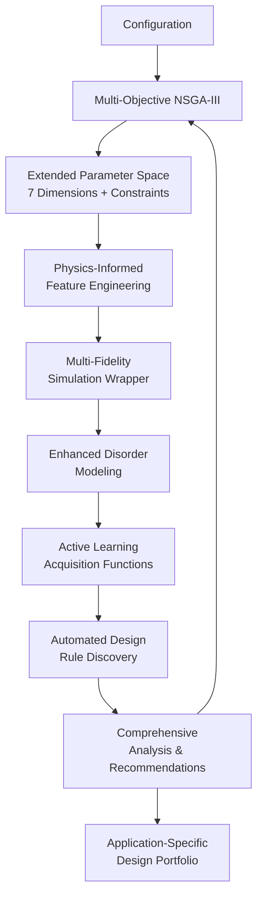

# Advanced ML Framework for Topological Photonic Crystal Optimization

[](https://www.python.org/downloads/)
[](https://opensource.org/licenses/MIT)

A physics-informed multi-objective machine learning framework for designing disorder-robust topological photonic crystal ring resonators.

## Overview

This framework implements a comprehensive machine learning approach to address fundamental physics trade-offs in topological photonics. The system leverages the Su-Schrieffer-Heeger (SSH) model with sophisticated ML techniques to discover optimal designs across a seven-dimensional parameter space.

### Key Capabilities

- **Multi-Objective Optimization**: NSGA-III algorithm optimizing four simultaneous physics objectives
- **Physics-Informed ML**: 13+ automatically generated physics features from domain expertise
- **Multi-Fidelity Simulation**: Adaptive resource allocation between high and low fidelity simulations
- **Automated Design Discovery**: Machine learning-based rule extraction and pattern recognition
- **Fabrication Robustness**: Enhanced disorder modeling with multiple error types

## Results

For detailed optimization results, design recommendations, and visualizations, see the **[Optimization Report](docs/OPTIMIZATION_REPORT.md)**.

<div align="center">


*Pareto-optimal trade-offs between Q-factor, robustness, bandgap, and mode volume*

</div>

| Design Type | Q-factor | Robustness Ratio | Application |
|-------------|----------|------------------|-------------|
| Maximum Q-Factor | 55,700 | 68.5 | Biological sensing |
| Maximum Robustness | 54,023 | 165.7 | Mass production |
| Maximum Topological | 35,968 | 82.2 | Research |
| Balanced Performance | 48,859 | 135.2 | Telecommunications |

## Features

| Component | Implementation | Description |
|-----------|----------------|-------------|
| Multi-Objective Optimization | NSGA-III with 4 physics objectives | Simultaneous Q-factor, robustness, bandgap, mode volume optimization |
| Physics-Informed Constraints | Fabrication feasibility + geometric limits | Automatic constraint violation detection and penalty |
| Active Learning | Multi-fidelity Gaussian Processes | Intelligent acquisition functions with physics knowledge |
| Feature Engineering | 13+ automated physics features | SSH model parameters, fabrication metrics, bending losses |
| Design Rule Discovery | ML-based pattern recognition | Random Forest, symbolic regression, SHAP analysis |
| Multi-Fidelity Strategy | Adaptive fidelity allocation | Progressive high-fidelity simulation allocation |

## Architecture



## Quick Start

### Prerequisites

```bash
python --version  # Python 3.8+ required
pip install --upgrade pip
```

### Installation

```bash
git clone https://github.com/Sakeeb91/topological-photonic-crystal-optimizer.git
cd topological-photonic-crystal-optimizer

# Create virtual environment (recommended)
python -m venv venv
source venv/bin/activate  # Linux/Mac
# venv\Scripts\activate   # Windows

pip install -r requirements.txt
```

### Running Optimization

```bash
# Framework demonstration
python demo_advanced_framework.py

# Multi-objective optimization with physics constraints
python run_multi_objective_optimization.py --config configs/advanced_multi_fidelity_v1.yaml

# Basic multi-objective test
python run_multi_objective_optimization.py --config configs/multi_objective_v1.yaml --generations 20

# Single-objective optimization (for comparison)
python run_optimization.py --config configs/strong_dimerization_v1.yaml
```

### Analysis and Design Discovery

```bash
# Automated design rule discovery
python -c "
from src.design_analysis import create_comprehensive_analysis_report
import pandas as pd
df = pd.read_csv('results/run_TIMESTAMP/pareto_front.csv')
results = create_comprehensive_analysis_report(df, 'results/analysis_TIMESTAMP')
"

# Visualize optimal designs
python visualize_best_design.py results/multi_obj_TIMESTAMP
```

## Project Structure

```
topological-optimizer/
├── src/                                 # ML Implementation
│   ├── multi_objective_optimizer.py        # NSGA-III + Physics Constraints
│   ├── active_learning.py                  # Multi-fidelity GP + Acquisition
│   ├── design_analysis.py                  # Automated Rule Discovery
│   ├── simulation_wrapper.py               # Simulation Interface
│   ├── analysis.py                         # Statistical Analysis
│   ├── utils.py                            # Utility Functions
│   └── geometry_utils.py                   # Geometry Visualization
├── configs/                             # Configuration Files
│   ├── advanced_multi_fidelity_v1.yaml     # Full Framework
│   ├── multi_objective_v1.yaml             # Basic Multi-objective
│   ├── strong_dimerization_v1.yaml         # Single-objective
│   └── explore_*.yaml                      # Parameter Space Exploration
├── docs/                                # Documentation
│   ├── images/                             # Visualization assets
│   ├── OPTIMIZATION_REPORT.md              # Results and recommendations
│   ├── ADVANCED_FRAMEWORK_SUMMARY.md       # Technical documentation
│   ├── EXPLORATION_RESULTS.md              # Scientific findings
│   └── RESEARCH_REPORT.md                  # Research context
├── results/                             # Auto-generated Results
├── run_multi_objective_optimization.py  # Multi-objective Script
├── demo_advanced_framework.py           # Framework Demonstration
├── run_optimization.py                  # Optimization Script
├── visualize_best_design.py             # Design Visualization
└── requirements.txt                     # Dependencies
```

## Configuration

### Multi-Fidelity Configuration Example

```yaml
# Extended Design Space (7 Parameters)
design_space:
  a: [0.30, 0.60]              # Primary dimerization (μm)
  b: [0.05, 0.20]              # Secondary dimerization (μm)
  r: [0.08, 0.16]              # Hole radius (μm)
  w: [0.45, 0.65]              # Waveguide width (μm)
  N_cells: [100, 200]          # Unit cells (discrete)
  coupling_gap: [0.15, 0.35]   # Coupling gap (μm)
  coupling_width: [0.45, 0.65] # Coupling width (μm)

# Physics-Informed Constraints
constraints:
  min_feature_size: 0.08       # Fabrication limit (μm)
  max_dimerization_ratio: 8.0  # Physical limit
  ring_constraint: "2πR = N_cells × (a + b)"

# Multi-Objective Optimization
objective:
  primary_objectives:
    - q_factor_maximization
    - disorder_robustness
    - bandgap_maximization
    - mode_volume_minimization

# NSGA-III Optimizer Settings
optimizer:
  algorithm: "NSGA3"
  population_size: 60
  n_generations: 80
  n_partitions: 5
  fidelity_strategy:
    adaptive_allocation: true
    initial_high_fidelity_fraction: 0.1
```

### Configuration Options

| Configuration | Level | Objectives | Use Case |
|---------------|-------|------------|----------|
| `advanced_multi_fidelity_v1.yaml` | Advanced | 4 simultaneous | Production research |
| `multi_objective_v1.yaml` | Multi-objective | 4 simultaneous | Rapid prototyping |
| `strong_dimerization_v1.yaml` | Single-objective | 1 composite | Baseline comparison |

## Physics Implementation

### Multi-Objective Formulation

The framework simultaneously optimizes four fundamental physics objectives:

```python
objectives = {
    'q_factor_avg': maximize,     # Average Q-factor performance
    'q_factor_std': minimize,     # Fabrication robustness
    'bandgap_size': maximize,     # Topological protection strength
    'mode_volume': minimize       # Light-matter interaction
}

# Ring circumference constraint: 2πR = N_cells × (a + b)
```

### Physics Feature Engineering

The framework automatically generates physics-informed features:

```python
# Topological physics features
dimerization_strength = |a - b|           # SSH coupling asymmetry
ssh_asymmetry = (a - b) / (a + b)         # Normalized SSH parameter
topological_gap_proxy = dimerization_strength / unit_cell_length

# Fabrication and geometric features
filling_factor = (hole_area × N_cells) / waveguide_area
min_feature_size = min(hole_spacing, edge_clearance)
bending_loss_proxy = exp(-R / w)          # Exponential bending loss
```

### Disorder Modeling

Multiple fabrication error types are modeled simultaneously:

```yaml
disorder:
  hole_radius_disorder_std: 0.06        # 6% hole radius variation
  sidewall_roughness_std: 0.008         # 8nm RMS sidewall roughness
  hole_position_disorder_std: 0.005     # 5nm positional error
  num_disorder_runs: 12                 # Statistical sampling
  adaptive_sampling: true               # More samples for uncertain designs
```

## Results and Analysis

### Pareto-Optimal Design Categories

The framework discovers trade-offs between competing physics objectives and generates application-specific recommendations:

1. **Maximum Q-Factor Design**
   - Application: Ultra-sensitive biological sensing, frequency references
   - Optimized for highest possible Q-factor with acceptable robustness trade-offs

2. **Maximum Robustness Design**
   - Application: Commercial manufacturing, mass production
   - Highest Q_avg/Q_std ratio for fabrication tolerance

3. **Maximum Topological Protection**
   - Application: Research into topological photonic phenomena
   - Largest bandgap for strongest edge state protection

4. **Minimum Mode Volume Design**
   - Application: Quantum optics, single-photon sources
   - Tightest light confinement for enhanced Purcell factor

5. **Balanced Performance Design**
   - Application: General-purpose telecommunications, integrated photonics
   - Optimal composite score across all objectives

### Output Structure

```
results/multi_obj_TIMESTAMP/
├── pareto_front.csv                    # Pareto optimal solutions
├── evaluation_history.pkl              # Optimization trajectory
├── plots/
│   └── multi_objective_trade_off_analysis.png
├── designs/
│   ├── design_recommendations.yaml
│   └── design_recommendations.md
└── comprehensive_analysis_report.md
```

### Automated Design Rule Discovery

The framework automatically discovers physics relationships:

```python
# Example discovered relationships
"dimerization_ratio strongly increases q_factor (importance: 0.342)"
"bending_loss_proxy moderately decreases q_factor (coef: -2.145)"
"Mathematical relationship: q_factor ≈ 15000 + 20000×(a-b) + 1000×R"
```

## Machine Learning Components

### Active Learning with Physics Knowledge

```python
# Physics-informed acquisition function
acquisition_score = (
    0.4 × expected_improvement +      # ML exploitation
    0.3 × uncertainty_sampling +      # ML exploration
    0.3 × physics_informed_score      # Domain knowledge
)

physics_preferences = {
    'dimerization_preference': 2.0,
    'ring_size_preference': 1.0,
    'fabrication_feasibility': 3.0,
}
```

### Multi-Fidelity Resource Management

```python
fidelity_schedule = {
    'early_phase': 0.1,    # 10% high-fidelity (broad exploration)
    'middle_phase': 0.3,   # 30% high-fidelity (focused search)
    'final_phase': 0.6     # 60% high-fidelity (precise optimization)
}
```

## Development

### Testing

```bash
# Test core components
python -c "from src.multi_objective_optimizer import MultiObjectiveOptimizer; print('Multi-objective core: OK')"
python -c "from src.active_learning import ActiveLearningOptimizer; print('Active learning: OK')"
python -c "from src.design_analysis import create_comprehensive_analysis_report; print('Analysis framework: OK')"

# Run complete demonstration
python demo_advanced_framework.py
```

### Code Quality

```bash
black src/ *.py --line-length 100
mypy src/multi_objective_optimizer.py src/active_learning.py
pip-audit
```

## Documentation

- [Optimization Report](docs/OPTIMIZATION_REPORT.md): Results with visualizations and design recommendations
- [Technical Framework Summary](docs/ADVANCED_FRAMEWORK_SUMMARY.md): Complete technical documentation
- [Exploration Results](docs/EXPLORATION_RESULTS.md): Scientific findings from parameter space exploration
- Configuration examples in `configs/` directory

## Research Context

### Physics Insights Integrated

Based on topological photonics research:

1. **Lattice vs Radiation Confinement Trade-off**: Multi-objective formulation captures fundamental physics
2. **Dimerization Parameter Dominance**: Physics-informed feature weighting prioritizes a/b ratio
3. **Fabrication Robustness Modeling**: Enhanced disorder simulation with multiple error types
4. **SSH Model Implementation**: Topological gap optimization with asymmetric coupling
5. **Design Space Exploration**: Automated regime identification and characterization

### Contributions

1. Multi-objective framework for simultaneous optimization of 4 physics objectives
2. Physics-informed ML with domain knowledge integration throughout the pipeline
3. Multi-fidelity resource allocation for computational efficiency
4. Automated design rule extraction and pattern recognition
5. Application-specific design recommendations

## Contributing

Contributions are welcome. Areas of interest include:

- Enhanced physics models for additional topological photonic phenomena
- Novel multi-objective optimization techniques
- Experimental validation and fabrication feedback
- GPU acceleration for large-scale optimization
- Extension to other photonic crystal systems

## License

This project is licensed under the MIT License. See the [LICENSE](LICENSE) file for details.

### Citation

```bibtex
@software{topological_ml_optimizer_2025,
  title = {Advanced ML Framework for Topological Photonic Crystal Optimization},
  author = {Shafkat Sakeebur Rahman},
  year = {2025},
  url = {https://github.com/Sakeeb91/topological-photonic-crystal-optimizer},
  note = {Physics-informed multi-objective optimization with automated design discovery}
}
```

## Acknowledgments

- A. Hotte-Kilburn: Foundational research on topological photonic crystal physics
- MEEP Development Team: Electromagnetic simulation framework
- Multi-objective optimization and active learning research communities

## Contact

- Issues: [GitHub Issues](https://github.com/Sakeeb91/topological-photonic-crystal-optimizer/issues)
- Discussions: [GitHub Discussions](https://github.com/Sakeeb91/topological-photonic-crystal-optimizer/discussions)
- Email: rahman.sakeeb@gmail.com
