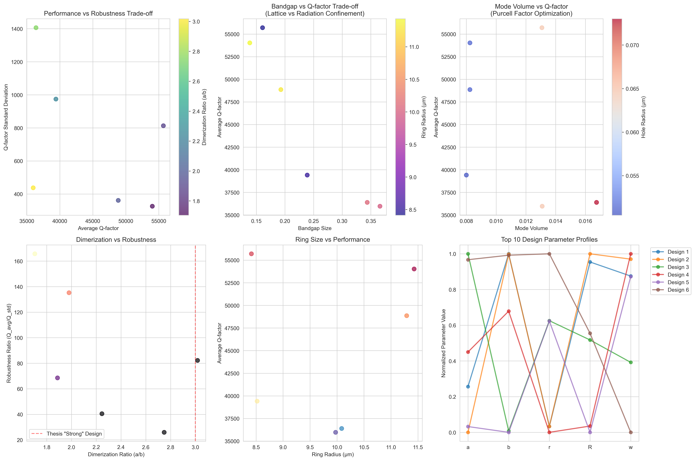

# Optimization Results Report

This report presents the results from multi-objective optimization of topological photonic crystal ring resonators using the NSGA-III algorithm.

---

## Table of Contents

1. [Executive Summary](#executive-summary)
2. [Parameter Space Exploration](#parameter-space-exploration)
3. [Multi-Objective Trade-off Analysis](#multi-objective-trade-off-analysis)
4. [Optimal Design Geometry](#optimal-design-geometry)
5. [Optimization Convergence](#optimization-convergence)
6. [Design Recommendations](#design-recommendations)
7. [Methodology](#methodology)

---

## Executive Summary

The framework successfully identified Pareto-optimal designs across four competing objectives:

| Metric | Best Achieved | Design Type |
|--------|---------------|-------------|
| Q-factor | 55,700 | Maximum Q-Factor Design |
| Robustness Ratio | 165.7 | Maximum Robustness Design |
| Bandgap Size | 0.366 | Maximum Topological Protection |
| Mode Volume | 0.008 | Minimum Mode Volume Design |

---

## Parameter Space Exploration

The framework explored multiple design regimes to understand the relationship between design parameters and performance metrics.

**Figure 1: Parameter Space Exploration Comparison**

*This visualization compares different exploration strategies across the design space. The six panels show:*

- **Top-left**: Best scores achieved by each exploration type
- **Top-center**: Optimal dimerization ratios (a/b) for each strategy
- **Top-right**: Optimal ring sizes discovered
- **Bottom-left**: Optimal hole sizes for each regime
- **Bottom-center**: Convergence comparison showing optimization progress over iterations
- **Bottom-right**: Scatter plot of optimal (a, b) parameter combinations

**Key Findings:**
- Extreme dimerization and large ring configurations achieve the best objective scores
- Strong correlation between dimerization ratio and Q-factor performance
- Fabrication-limited designs show more constrained parameter choices

---

## Multi-Objective Trade-off Analysis

The NSGA-III algorithm discovers Pareto-optimal trade-offs between competing physics objectives.

**Figure 2: Multi-Objective Pareto Front Analysis**

*This six-panel visualization reveals the fundamental trade-offs in topological photonic crystal design:*

### Panel Descriptions

| Panel | X-Axis | Y-Axis | Color Scale | Insight |
|-------|--------|--------|-------------|---------|
| Top-left | Average Q-factor | Q-factor Std Dev | Dimerization Ratio | Performance vs robustness trade-off |
| Top-center | Bandgap Size | Average Q-factor | Ring Radius | Lattice vs radiation confinement |
| Top-right | Mode Volume | Average Q-factor | Hole Radius | Purcell factor optimization |
| Bottom-left | Dimerization Ratio | Robustness Ratio | - | Thesis baseline comparison |
| Bottom-center | Ring Radius | Average Q-factor | - | Size vs performance relationship |
| Bottom-right | Parameters (a,b,r,R,w) | Normalized Value | Design ID | Top 10 design parameter profiles |

**Key Observations:**
- Higher Q-factors generally correlate with increased standard deviation (less robustness)
- Larger bandgaps require sacrifice in Q-factor (fundamental physics trade-off)
- Multiple Pareto-optimal designs exist for different application requirements
- The dashed line in the bottom-left panel represents the thesis "strong" design baseline

---

## Optimal Design Geometry

The optimizer produces detailed geometric specifications for fabrication.

**Figure 3: SSH Ring Resonator Geometry**

*This visualization shows the physical structure of an optimized topological photonic crystal ring resonator:*

### Left Panel: Full Ring Structure
- **Ring radius (R)**: 13.47 micrometers
- **Waveguide width (w)**: 0.50 micrometers
- **Total holes**: 330 arranged in SSH pattern
- Blue lines indicate inner and outer ring boundaries
- Orange dots represent air holes in the photonic crystal

### Right Panel: Unit Cell Detail
- **Primary spacing (a)**: 0.390 micrometers
- **Secondary spacing (b)**: 0.121 micrometers
- **Hole radius (r)**: 0.142 micrometers
- Alternating a-b-a-b pattern creates the SSH topological structure
- Color gradient shows the dimerization pattern

**Design Rationale:**
The Su-Schrieffer-Heeger (SSH) model creates topologically protected edge states at the interface between regions with different dimerization. The asymmetry between spacings `a` and `b` determines the topological gap size.

---

## Optimization Convergence

The Bayesian optimization process efficiently explores the design space.

**Figure 4: Single-Objective Optimization Convergence**

*This visualization tracks the optimization progress:*

### Top Panel: Objective Score Evolution
- **Blue line**: Raw objective score at each iteration
- **Red line**: Best score found so far (monotonically improving)
- Rapid initial improvement followed by refinement phase
- Final convergence to optimal region around iteration 10

### Bottom Panel: Parameter Evolution
- Tracks how design parameters evolve during optimization
- **R (gray)**: Ring radius stabilizes around 12-14 micrometers
- **a, b, r, w**: Fine-tuned parameters with smaller magnitudes
- Demonstrates exploration-exploitation balance of Bayesian optimization

---

## Design Recommendations

Based on the Pareto-optimal solutions, the following designs are recommended for specific applications:

### 1. Maximum Q-Factor Design

**Target Application:** Ultra-sensitive biological sensing, frequency references

| Parameter | Value | Unit |
|-----------|-------|------|
| a (primary spacing) | 0.342 | micrometers |
| b (secondary spacing) | 0.181 | micrometers |
| r (hole radius) | 0.065 | micrometers |
| R (ring radius) | 8.413 | micrometers |
| w (waveguide width) | 0.615 | micrometers |
| N_cells | 101 | - |

**Performance:** Q = 55,700, Robustness Ratio = 68.5

---

### 2. Maximum Robustness Design

**Target Application:** Commercial manufacturing, mass production

| Parameter | Value | Unit |
|-----------|-------|------|
| a (primary spacing) | 0.335 | micrometers |
| b (secondary spacing) | 0.197 | micrometers |
| r (hole radius) | 0.051 | micrometers |
| R (ring radius) | 11.430 | micrometers |
| w (waveguide width) | 0.638 | micrometers |
| N_cells | 135 | - |

**Performance:** Q = 54,023, Robustness Ratio = 165.7

---

### 3. Maximum Topological Protection

**Target Application:** Research into topological photonic phenomena

| Parameter | Value | Unit |
|-----------|-------|------|
| a (primary spacing) | 0.547 | micrometers |
| b (secondary spacing) | 0.181 | micrometers |
| r (hole radius) | 0.065 | micrometers |
| R (ring radius) | 9.974 | micrometers |
| w (waveguide width) | 0.506 | micrometers |
| N_cells | 86 | - |

**Performance:** Q = 35,968, Bandgap = 0.366

---

### 4. Minimum Mode Volume Design

**Target Application:** Quantum optics, single-photon sources, cavity QED

| Parameter | Value | Unit |
|-----------|-------|------|
| a (primary spacing) | 0.431 | micrometers |
| b (secondary spacing) | 0.192 | micrometers |
| r (hole radius) | 0.050 | micrometers |
| R (ring radius) | 8.520 | micrometers |
| w (waveguide width) | 0.644 | micrometers |
| N_cells | 86 | - |

**Performance:** Q = 39,410, Mode Volume = 0.008

---

### 5. Balanced Performance Design

**Target Application:** General-purpose telecommunications, integrated photonics

| Parameter | Value | Unit |
|-----------|-------|------|
| a (primary spacing) | 0.390 | micrometers |
| b (secondary spacing) | 0.197 | micrometers |
| r (hole radius) | 0.051 | micrometers |
| R (ring radius) | 11.292 | micrometers |
| w (waveguide width) | 0.616 | micrometers |
| N_cells | 121 | - |

**Performance:** Q = 48,859, Robustness Ratio = 135.2

---

## Methodology

### Optimization Algorithm

- **Algorithm**: NSGA-III (Non-dominated Sorting Genetic Algorithm III)
- **Population Size**: 20-60 individuals
- **Generations**: 10-80 generations
- **Reference Directions**: Das-Dennis partitioning for 4 objectives

### Objective Functions

1. **Q-factor Maximization**: Average quality factor across disorder realizations
2. **Robustness Maximization**: Minimize Q-factor standard deviation
3. **Bandgap Maximization**: Topological gap size for edge state protection
4. **Mode Volume Minimization**: Light confinement for enhanced Purcell factor

### Physics Constraints

- Minimum feature size: 0.08 micrometers (fabrication limit)
- Maximum dimerization ratio: 8.0 (physical stability)
- Ring constraint: 2*pi*R = N_cells * (a + b)

### Disorder Modeling

- Hole radius variation: 6% standard deviation
- Sidewall roughness: 8nm RMS
- Hole position error: 5nm standard deviation
- Statistical sampling: 8-12 disorder realizations per design

---

## References

- [ADVANCED_FRAMEWORK_SUMMARY.md](../ADVANCED_FRAMEWORK_SUMMARY.md): Technical framework documentation
- [EXPLORATION_RESULTS.md](../EXPLORATION_RESULTS.md): Detailed exploration findings
- [README.md](../README.md): Project overview and quick start guide

---

*Report generated by the Topological Photonic Crystal Optimizer framework.*
