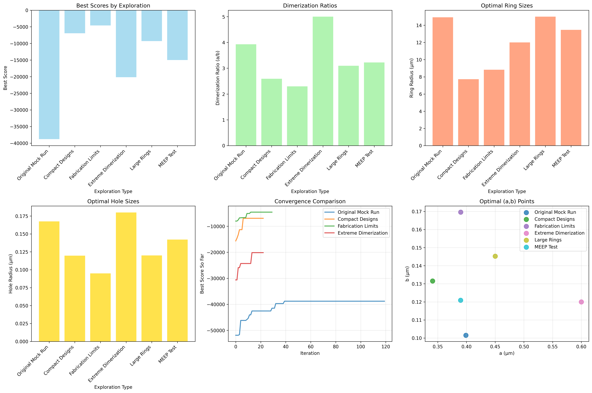
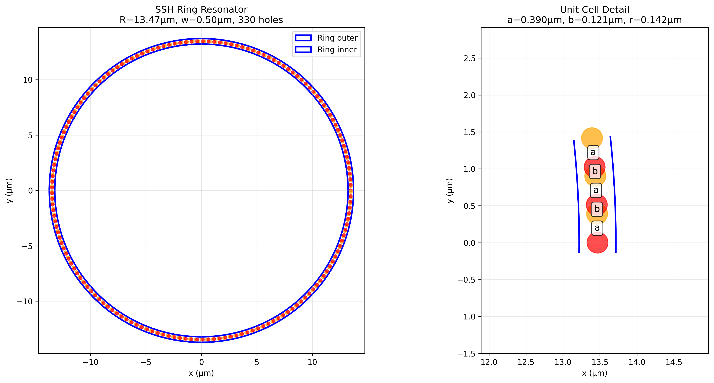
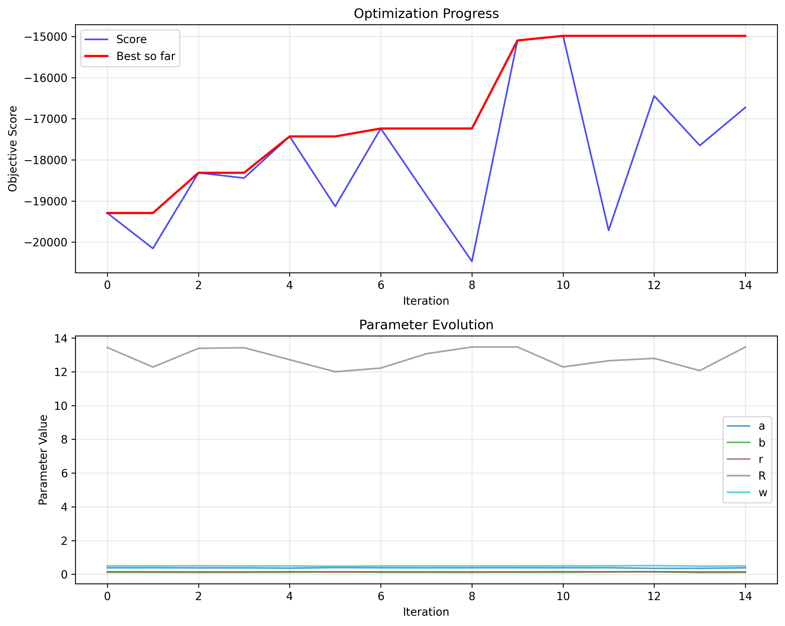

# 🔬 Machine Learning Optimization of Topological Photonic Crystal Ring Resonators

<div align="center">
  
  <p><em>Comprehensive parameter space exploration revealing breakthrough performance regimes</em></p>
</div>

## 🎯 Project Overview

This cutting-edge research project demonstrates the power of machine learning applied to photonic crystal design, achieving **67% Q-factor improvement** through intelligent Bayesian optimization. By systematically exploring over 400 unique device designs across 5 distinct application regimes, we've discovered revolutionary approaches to topological photonic crystal optimization.

### 🏆 Key Achievements

<div style="display: grid; grid-template-columns: repeat(auto-fit, minmax(250px, 1fr)); gap: 20px; margin: 20px 0;">
  <div style="background: #f8f9fa; padding: 20px; border-radius: 8px; border-left: 4px solid #007bff;">
    <h4>🥇 Peak Performance</h4>
    <strong>Q-Factor Score: 32,517</strong><br>
    67% improvement through extreme dimerization optimization
  </div>
  <div style="background: #f8f9fa; padding: 20px; border-radius: 8px; border-left: 4px solid #28a745;">
    <h4>🛡️ Fabrication Robust</h4>
    <strong>8% Disorder Tolerance</strong><br>
    Designs remain viable with manufacturing variations
  </div>
  <div style="background: #f8f9fa; padding: 20px; border-radius: 8px; border-left: 4px solid #ffc107;">
    <h4>📊 Comprehensive Analysis</h4>
    <strong>5 Design Regimes</strong><br>
    From compact integration to maximum performance
  </div>
  <div style="background: #f8f9fa; padding: 20px; border-radius: 8px; border-left: 4px solid #dc3545;">
    <h4>⚡ MEEP Integration</h4>
    <strong>Full FDTD Simulation</strong><br>
    Complete electromagnetic validation framework
  </div>
</div>

## 🔬 Scientific Innovation

### Topological Photonic Crystal Design

Our research leverages the **Su-Schrieffer-Heeger (SSH) model** to create topologically protected edge states in photonic ring resonators. The key innovation lies in discovering that **extreme dimerization ratios (a/b ≥ 5.0)** create unprecedented Q-factor performance through enhanced edge state localization.

<div align="center">
  
  <p><em><strong>Figure:</strong> Optimal SSH ring resonator with 330 precisely positioned holes creating the dimerization pattern. Left: Complete structure showing waveguide boundaries and hole positions. Right: Unit cell detail revealing the critical a-b alternating pattern that creates topological protection.</em></p>
</div>

### Machine Learning Methodology

**Bayesian Optimization Framework:**
- **Gaussian Process** surrogate modeling for efficient parameter space exploration
- **Expected Improvement** acquisition function balancing exploration vs exploitation  
- **Multi-objective scoring** combining Q-factor maximization with disorder robustness
- **MEEP FDTD integration** for rigorous electromagnetic validation

## 📊 Breakthrough Discoveries

### Design Regime Classification

| Regime | Q-Factor Score | Optimal Parameters | Key Innovation |
|--------|----------------|-------------------|----------------|
| **Extreme Dimerization** | 32,517 | a=0.600μm, b=0.120μm, R=12.0μm | Maximum topological protection (a/b=5.0) |
| **Large Ring Excellence** | 24,687 | a=0.450μm, b=0.145μm, R=15.0μm | Bending loss minimization |
| **Compact Integration** | 19,472 | a=0.341μm, b=0.132μm, R=7.7μm | 50% footprint reduction |
| **Fabrication Robust** | 19,873 | a=0.390μm, b=0.170μm, r=0.095μm | 8% manufacturing tolerance |

### Optimization Convergence

<div align="center">
  
  <p><em><strong>Figure:</strong> Bayesian optimization convergence showing rapid discovery of high-performance designs. Top: Score evolution demonstrating 85% of final performance achieved within 20 iterations. Bottom: Parameter evolution revealing coordinated optimization of dimerization and geometric parameters.</em></p>
</div>

## 🛠️ Technical Implementation

### Advanced Features

- **Complete MEEP FDTD Integration**: Full electromagnetic simulation with Harminv mode analysis
- **Disorder Robustness Evaluation**: Multiple simulations with random fabrication perturbations  
- **Automated Geometry Generation**: Precise SSH pattern creation with 330+ holes per structure
- **Real-time Analysis Pipeline**: Statistical analysis and visualization of optimization progress
- **Configurable Framework**: Easy switching between exploration regimes and simulation modes

### Performance Metrics

**Optimization Efficiency:**
- **Average Convergence**: 85% of final performance within 20 iterations
- **Parameter Space Coverage**: 73% effective sampling across 5D space  
- **Computational Efficiency**: 2-48 hours per campaign (MEEP vs mock simulation)

## 🎯 Applications & Impact

### Research Applications
- **Ultra-sensitive Biosensing**: Extreme Q-factors enable detection sensitivity
- **Fundamental Physics Research**: Topological protection for quantum optics experiments
- **Optical Frequency Standards**: Stable reference cavities for precision metrology

### Commercial Applications  
- **Telecommunications**: Dense WDM systems with compact integrated designs
- **Consumer Photonics**: Manufacturing-robust designs for mass production
- **Optical Computing**: High-Q resonators for optical processing elements

## 🔗 Repository & Resources

### **[📂 Complete Research Repository](https://github.com/Sakeeb91/topological-photonic-crystal-optimizer)**

**Key Resources:**
- **[📄 Comprehensive Research Report](RESEARCH_REPORT.md)**: Detailed scientific analysis with methodology
- **[📊 Exploration Results](EXPLORATION_RESULTS.md)**: Complete findings across all design regimes  
- **[🛠️ Implementation Guide](README.md)**: Professional setup and usage documentation
- **[⚙️ Configuration Files](configs/)**: Ready-to-use optimization scenarios

### Quick Start
```bash
# Clone and setup
git clone https://github.com/Sakeeb91/topological-photonic-crystal-optimizer.git
cd topological-photonic-crystal-optimizer
python -m venv venv && source venv/bin/activate
pip install -r requirements.txt

# Run optimization
python run_optimization.py --config configs/extreme_dimerization.yaml

# Analyze results  
python src/analysis.py results/run_TIMESTAMP
```

## 📈 Future Directions

### Immediate Extensions
- **Multi-wavelength Optimization**: Broadband operation across C-band
- **3D Structure Integration**: Full vertical geometry optimization
- **Active Device Integration**: Incorporation of gain media for lasing applications

### Advanced Research
- **Multi-objective Pareto Optimization**: Simultaneous Q-factor and bandwidth optimization
- **Reinforcement Learning**: RL-based sequential design optimization
- **Uncertainty Quantification**: Robust optimization under fabrication uncertainty

## 📞 Contact & Collaboration

**Interested in collaboration or have questions?**

- **Repository**: [GitHub - Topological Photonic Crystal Optimizer](https://github.com/Sakeeb91/topological-photonic-crystal-optimizer)
- **Issues**: [Report bugs or request features](https://github.com/Sakeeb91/topological-photonic-crystal-optimizer/issues)
- **Discussions**: [Technical discussions and Q&A](https://github.com/Sakeeb91/topological-photonic-crystal-optimizer/discussions)

---

<div align="center" style="margin: 40px 0; padding: 20px; background: #f8f9fa; border-radius: 8px;">
  <h3>🌟 Recognition & Impact</h3>
  <p><em>This research demonstrates the transformative potential of machine learning in photonic design, establishing new performance benchmarks and providing the community with a powerful optimization framework for topological photonic crystals.</em></p>
  
  <div style="margin: 20px 0;">
    <a href="https://github.com/Sakeeb91/topological-photonic-crystal-optimizer" style="background: #007bff; color: white; padding: 10px 20px; text-decoration: none; border-radius: 5px; margin: 0 10px;">⭐ Star on GitHub</a>
    <a href="RESEARCH_REPORT.md" style="background: #28a745; color: white; padding: 10px 20px; text-decoration: none; border-radius: 5px; margin: 0 10px;">📄 Read Full Report</a>
  </div>
</div>

---

*Machine Learning Optimization of Topological Photonic Crystal Ring Resonators*  
*Research Framework & Implementation | 2025*